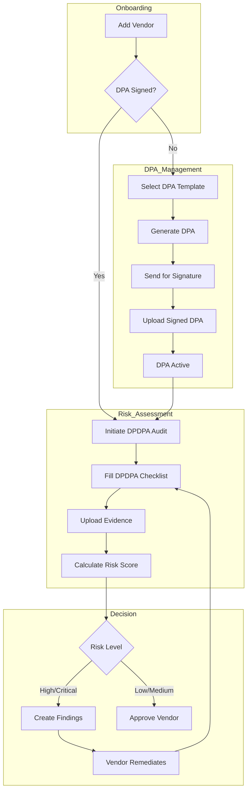

# TPRM & DPDPA Compliance Workflow

## Overview
This document outlines the Third-Party Risk Management (TPRM) workflow tailored for the Digital Personal Data Protection Act (DPDPA), 2023. It ensures that all Data Processors (Vendors) engaged by the Data Fiduciary are compliant with the law.

## Workflow Stages

### 1. Vendor Onboarding
- **Action**: Fiduciary adds a new vendor to the system.
- **Data**: Company Name, Contact Details, Service Description.
- **Initial Status**: `Onboarding`

### 2. Data Processing Agreement (DPA) Management
DPDPA mandates a valid contract between Fiduciary and Processor (Section 8(2)).

- **Step 2a: Template Selection**
    - System provides standard DPA templates (e.g., "Standard DPA", "High-Risk DPA").
    - Fiduciary selects the appropriate template.
- **Step 2b: Generation**
    - System generates a PDF contract, auto-filling vendor details.
- **Step 2c: Negotiation & Signing**
    - The DPA is sent to the vendor (offline or via email integration).
    - Status: `Sent`.
- **Step 2d: Activation**
    - Once signed, the Fiduciary uploads the signed PDF.
    - System validates the validity period.
    - Status: `Active`.

### 3. DPDPA Risk Assessment (Audit)
Before sharing data, the Fiduciary must assess the Processor's capability to protect data.

- **Step 3a: Initiation**
    - Fiduciary starts a new "DPDPA Compliance Audit" for the vendor.
- **Step 3b: Questionnaire (The Checklist)**
    - The assessment consists of specific questions derived from DPDPA obligations:
        1.  **Security Safeguards (Sec 8(4))**: Encryption, Access Controls, Firewalls.
        2.  **Breach Notification (Sec 8(6))**: SLA for reporting breaches to Fiduciary.
        3.  **Data Erasure (Sec 8(7))**: Mechanisms to delete data upon request.
        4.  **Sub-processing (Sec 8(2))**: Policy for hiring sub-contractors.
        5.  **Grievance Redressal**: Ability to handle user complaints.
- **Step 3c: Evidence Collection**
    - For each "Yes" answer, the vendor/assessor must upload evidence (e.g., ISO 27001 cert, SOC2 report, Policy Docs).
- **Step 3d: Scoring**
    - System calculates a Risk Score based on responses.
    - *Critical Questions* (e.g., "Do you encrypt data?") carry higher weight.
    - **Risk Levels**: Low (0-20), Medium (21-50), High (51-80), Critical (81-100).

### 4. Remediation & Approval
- **High/Critical Risk**:
    - System flags the vendor.
    - Fiduciary creates "Findings" (Issues) with "Remediation Plans".
    - Vendor must fix issues before approval.
- **Low/Medium Risk**:
    - Fiduciary reviews and approves the vendor.
    - Vendor Status: `Approved`.

### 5. Continuous Monitoring
- **Annual Re-assessment**: System alerts Fiduciary when the audit is due for renewal (e.g., every 12 months).
- **Incident-Triggered**: If a breach occurs, the vendor status is reset to `Under Review`.

## Mermaid Diagram

